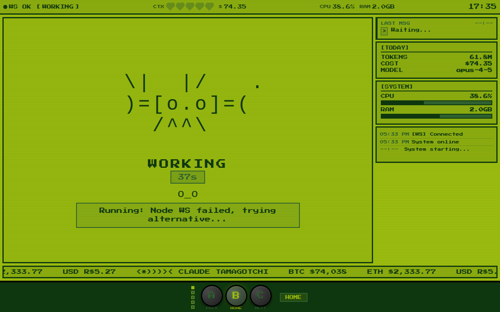

# OpenClaw Tamagotchi Display v2.3




A beautiful wall-mounted display for OpenClaw/Claude, optimized for 7-inch touchscreens (1024x600).

## Features

### 🔌 Real-Time WebSocket Connection
- **Live connection** to OpenClaw Gateway at ws://localhost:18789
- Automatic authentication with challenge-response
- Real-time event streaming:
  - Session start/end
  - Subagent spawn/completion
  - Message received/sent
  - Tool usage
- **Improved reconnection** with exponential backoff (3s → 60s max)
- Connection status indicator (top-right corner)
- Falls back to polling if WebSocket disconnects

### 🕐 Real-Time Clock
- Large, prominent clock (72px font)
- Full date display with weekday
- Brazilian Portuguese locale

### 🌤️ Weather Widget
- Live weather for São Paulo via wttr.in API
- Shows temperature, feels-like, and condition
- Dynamic weather icons
- Updates every 10 minutes

### 💰 Crypto Ticker
- BTC, ETH prices from CoinGecko
- USD/BRL exchange rate
- Flash animation on price changes
- Graceful fallback on API errors

### 🤖 Claude Avatar & Status
- **Real-time status** via WebSocket events
- **Fallback polling** from `status.json`
- Animation states:
  - **Idle**: Gentle breathing animation - "Waiting for messages"
  - **Thinking**: Orange glow - processing/analyzing
  - **Chatting**: Green glow - active conversation
  - **Working**: Purple glow - subagent active
  - **Searching**: Blue glow - web search
- Simple subagent display: "Subagent: task-name"
- No fake simulation - only real status

### 📊 Multiple Views
- **Home**: Main status dashboard
- **Charts**: BTC/ETH price charts
- **Status**: Detailed system status
- **Settings**: Display configuration

### 📋 Activity Log (v2.3 Fixed)
- **Only shows REAL Claude system events**:
  - Message received from users
  - Subagent spawned/completed
  - Tool executions
  - Session start/end
- **No more UI clutter** (weather, crypto, chart updates are NOT logged)
- Rolling log with timestamps
- Keeps last 8 entries

### 🎯 Compact Status Bar (v2.3 Fixed)
Clean, cohesive format:
```
🟢 Online | 1 Session | opus-4-5 | CPU 23% | RAM 1.5GB | Disk 30GB
```

## Files

- `index.html` - Main display (all-in-one HTML/CSS/JS)
- `websocket.js` - WebSocket client for gateway connection (v2.3: improved reconnection)
- `serve.py` - Python HTTP server with stats, config & status API
- `status.json` - Current status (fallback for polling)
- `openclaw-status.js` - Status monitor class
- `update-status.sh` - CLI tool to update status
- `start-display.sh` - Launch script
- `stop-display.sh` - Stop script

## Usage

```bash
# Start the display server
./start-display.sh

# Access at http://localhost:8793

# Stop the server
./stop-display.sh
```

## WebSocket Connection

The display connects to the OpenClaw Gateway WebSocket at `ws://localhost:18789`.

### Connection Status Indicator

A small indicator in the top-right corner shows:
- **Blue dot + "WS ✓"**: Connected & authenticated
- **Green dot + "WS"**: Connected
- **Yellow dot + "WS..."**: Connecting
- **Red dot + "WS ✗"**: Disconnected

### v2.3 Reconnection Improvements
- **Exponential backoff**: 3s → 6s → 12s → 24s → 48s → 60s (capped)
- **Max 20 attempts** before 5-minute cooldown
- **Connection timeout**: 10 seconds per attempt
- **Better error handling**: Graceful fallback to polling

### Events Monitored

| Event | Activity Log Entry |
|-------|-------------------|
| `session.started` | "📱 Session started (N active)" |
| `session.ended` | "📱 Session ended (N active)" |
| `subagent.spawned` | "🤖 Subagent spawned: task-name" |
| `subagent.completed` | "✅ Subagent completed: task-name" |
| `message.received` | "📥 Message from User" |
| `tool.started` | "🔧 Tool: web_search" |

## API Endpoints

| Endpoint | Method | Description |
|----------|--------|-------------|
| `/` | GET | Main display |
| `/stats` | GET | Hardware stats (CPU, RAM, disk) |
| `/config` | GET | WebSocket configuration (token) |
| `/update-status` | POST | Update status.json from WebSocket |
| `/status.json` | GET/PUT | Direct status file access |

## Fallback Polling

If WebSocket is unavailable, the display falls back to polling `status.json` every 10 seconds.

Update status manually:
```bash
# Reset to idle
./update-status.sh

# Set working state
./update-status.sh working "Processing request"

# Show subagent
./update-status.sh working "" my-subagent-label
```

### Status Format

```json
{
  "state": "idle|thinking|chatting|working|searching",
  "activity": "Waiting for messages",
  "subagent": null | "subagent-label",
  "sessions": 1,
  "subagents": 0,
  "lastUpdate": "2024-01-30T12:00:00-03:00",
  "wsConnected": true
}
```

## For Kiosk Mode

On a Raspberry Pi or similar:

```bash
chromium-browser --kiosk --noerrdialogs --disable-translate \
  --no-first-run --fast --fast-start --disable-infobars \
  --disable-features=TranslateUI --disk-cache-dir=/dev/null \
  http://localhost:8793
```

## API Dependencies

- **Gateway**: OpenClaw Gateway WebSocket at ws://localhost:18789
- **Weather**: wttr.in (free, no API key)
- **Crypto**: CoinGecko (free tier)
- **System Stats**: `/stats` endpoint (CPU, RAM, disk)

## Version History

- **v2.3** - Fixed activity log (only Claude events), cleaner status bar, improved WebSocket reconnection
- **v2.2** - Added WebSocket connection for real-time updates from OpenClaw Gateway
- **v2.1** - Removed fake simulation, added real status polling via `status.json`
- **v2.0** - Major update with weather, multi-view, settings panel
- **v1.0** - Initial release with basic clock, crypto, and avatar
